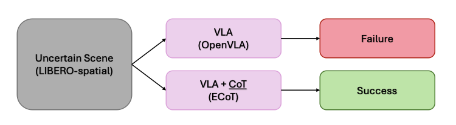

# Adaptive CoT in VLA: Chain-of-Thought for Vision-Language-Action Models in Uncertain Scenarios

Dongwha Kang, Sehee Kweon, Wooyul Jung

---

**Adaptive CoT in VLA** is an Embodied Chain-of-Thought (ECoT) reasoning in vision-language-action (VLA) models in uncertain scenarios. CoT is used to improve success rate and reasoning faithfulness when the uncertainty from the action tokens is high. Experiments in LIBERO simulation shows  **proper Chain-of-Thought is helpful** by improving task success rate and reasoning faithfulness.
<p align="center">
  
</p>
<!-- > Embodied Chain-of-Thought (ECoT) reasoning enhances VLA models by improving performance and interpretability through intermediate reasoning steps.  -->
<!-- However, its sequential autoregressive token generation introduces significant inference latency, limiting real-time deployment.  -->


## Dataset

We train and evaluate our method on the **LIBERO-Spatial** dataset, which contains 10 manipulation tasks that require **spatial reasoning** — for example, placing an object relative to another object ("put the bowl *on top of* the plate," "put the mug *to the left of* the plate"). These tasks are well-suited for evaluating the effect of reasoning, since the robot must identify spatial relationships before acting.

**Why LIBERO-Spatial?**
- **Reasoning-sensitive tasks:** The spatial nature of the tasks allows us to clearly observe the impact of Embodied Chain-of-Thought (ECoT) reasoning on uncertain or ambiguous scenes.
- **Randomized evaluation environments:** LIBERO generates a new scene configuration (object positions, distractors, etc.) every time an evaluation episode is run. This provides a clean separation between **training** and **evaluation** conditions, so reported success rates reflect true generalization rather than memorization.
- **Rich annotations:** The dataset includes task-, plan-, and subtask-level reasoning annotations, which are necessary for training and evaluating ECoT policies.

We use **two versions** of LIBERO in this project:
1. **Original LIBERO-Spatial (HDF5 format)** — used for **evaluation** in the LIBERO simulator.
2. **LIBERO-RLDS (modified, no-noops)** — used for **training** the VLA policy, following the OpenVLA/ECoT pipeline.

---

### 1. (for evaluation) Original LIBERO-Spatial 

The original LIBERO dataset is provided in HDF5 format by the [official LIBERO repository](https://github.com/Lifelong-Robot-Learning/LIBERO). It is required for running evaluation rollouts in the LIBERO simulator.
```bash
# Clone the LIBERO repo (provides the simulator + download utility)
git clone https://github.com/Lifelong-Robot-Learning/LIBERO.git
cd LIBERO
pip install -e .

# Download the LIBERO-Spatial split
python benchmark_scripts/download_libero_datasets.py --datasets libero_spatial

# Saved under: ./datasets/libero_spatial/
```

---

### 2. (for training) LIBERO-RLDS — modified, no-noops

For training, we use the **RLDS-formatted** version released by OpenVLA, which removes no-op actions for more efficient policy learning. This is the standard training format used by OpenVLA and ECoT.

Source: [openvla/modified_libero_rlds](https://huggingface.co/datasets/openvla/modified_libero_rlds/tree/main/libero_10_no_noops/1.0.0)
```bash
# Install huggingface CLI if not already installed
pip install -U "huggingface_hub[cli]"

# Download the LIBERO-Spatial (no-noops) RLDS split
huggingface-cli download openvla/modified_libero_rlds \
    --repo-type dataset \
    --include "libero_spatial_no_noops/*" \
    --local-dir ./datasets/modified_libero_rlds
```

> **Note:** The HuggingFace repo contains multiple splits (`libero_spatial_no_noops`, `libero_object_no_noops`, `libero_goal_no_noops`, `libero_10_no_noops`). Replace the `--include` pattern above with the split you want to download. To grab all splits at once, omit the `--include` flag.
```
After downloading, the directory structure should look like:
datasets/
├── libero_spatial/                        # original HDF5 (evaluation)
│   └── *.hdf5
└── modified_libero_rlds/                  # RLDS (training)
└── libero_spatial_no_noops/
└── 1.0.0/
├── dataset_info.json
├── features.json
└── .tfrecord-
```
Update the dataset paths in your config file accordingly:
```yaml
# configs/dataset.yaml
eval_dataset_path: ./datasets/libero_spatial/
train_dataset_path: ./datasets/modified_libero_rlds/libero_spatial_no_noops/1.0.0/
```

## Model

We build on two Vision-Language-Action (VLA) architectures: **OpenVLA** and **ECoT (Embodied Chain-of-Thought)**.

### OpenVLA

OpenVLA is a 7B-parameter VLA model built on a vision-language backbone (Prismatic VLM). It takes a single RGB image and a natural language task instruction as input, and directly predicts a 7-DoF robot action (Δx, Δy, Δz, Δroll, Δpitch, Δyaw, gripper).

<p align="center">
  
</p>

### ECoT (Embodied Chain-of-Thought)

ECoT extends OpenVLA by injecting a **chain-of-thought reasoning step** before action prediction. Given the same image and instruction, the model first generates structured reasoning tokens — task description, plan, and subtask decomposition — then predicts the action conditioned on this reasoning trace. This explicit reasoning improves performance on tasks that require spatial understanding and multi-step planning.

<p align="center">
  
</p>

### Pretrained Checkpoints

| Model | Dataset | Checkpoint |
|---|---|---|
| OpenVLA (fine-tuned) | LIBERO-Spatial | [openvla-7b-finetuned-libero-spatial](https://huggingface.co/openvla/openvla-7b-finetuned-libero-spatial) |
| ECoT (LoRA, rank 32) | LIBERO-Spatial | [ecot-libero-spatial-r32](https://huggingface.co/leepanic/ecot-libero-spatial-r32/tree/main) |

To download a checkpoint:
```bash
# OpenVLA fine-tuned
git clone https://huggingface.co/openvla/openvla-7b-finetuned-libero-spatial
cd openvla-7b-finetuned-libero-spatial && git lfs fetch --all && cd ..

# ECoT LoRA
git clone https://huggingface.co/leepanic/ecot-libero-spatial-r32
cd ecot-libero-spatial-r32 && git lfs fetch --all && cd ..
```

## Demo

<p align="center">
  
</p>

## Installation

### Prerequisites
- **OS:** Linux (Ubuntu 20.04 / 22.04 recommended)
- **GPU:** 
(for training) NVIDIA GPU with ≥ 24 GB VRAM (e.g., RTX 3090 / 4090, A100) 
(for evaluation) NVIDIA GPU with ≥ 16 GB VRAM (e.g., RTX 3060 / 3070, A100)
- **CUDA:** 12.1 or 12.4
- **Python:** 3.10
- **Conda** (Miniconda or Anaconda)

### 1. Create the conda environment
```bash
conda create -n VLA python=3.10 -y
conda activate VLA
```

### 2. Install PyTorch

Install the PyTorch build that matches your CUDA version.
See the [official selector](https://pytorch.org/get-started/locally/) if you need a different version.
```bash
# CUDA 12.4
conda install pytorch torchvision torchaudio pytorch-cuda=12.4 -c pytorch -c nvidia -y
```

### 3. Clone and install Adaptive-CoT-in-VLA repository
```bash
git clone https://github.com/seram7/Adaptive-CoT-in-VLA.git
cd Adaptive-CoT-in-VLA
pip install -e .
```

### 4. Install LIBERO simulator (required for evaluation)
```bash
git clone https://github.com/Lifelong-Robot-Learning/LIBERO.git
cd LIBERO
pip install -e .
cd ..
```

### 5. Verify installation
```bash
python -c "import torch; print('PyTorch:', torch.__version__, '| CUDA available:', torch.cuda.is_available())"
python -c "import flash_attn; print('Flash-Attn:', flash_attn.__version__)"
python -c "import libero; print('LIBERO: OK')"
```

All three commands should print without error.


## Training

### Prerequisites

Make sure you have completed the [installation steps](#installation) before proceeding.

#### Download Base Models and Data
```bash
# Install Git LFS
sudo apt update && sudo apt install git-lfs
git lfs install

# Download the base model
git clone https://huggingface.co/openvla/openvla-7b-prismatic
cd openvla-7b-prismatic && git lfs fetch --all && cd ..

# (Optional) Download the ECoT-finetuned base model for LoRA fine-tuning
git clone https://huggingface.co/Embodied-CoT/ecot-openvla-7b-oxe

# Download dataset (written in [Dataset section](#dataset))
git clone https://huggingface.co/datasets/openvla/modified_libero_rlds
```

#### Prepare Reasoning Annotations

If using ECoT reasoning, place the reasoning JSON file in the dataset directory:
```bash
cp reasoning.json <DATA_ROOT_DIR>/<DATASET_NAME>/reasoning.json
```

> **Note:** `<DATA_ROOT_DIR>` is the parent directory containing your RLDS datasets (e.g., `./datasets/modified_libero_rlds`), and `<DATASET_NAME>` is the specific split you're training on (e.g., `libero_spatial_no_noops`).

---

### Full Fine-Tuning

Train from scratch on RLDS-formatted datasets:
```bash
torchrun --standalone --nnodes 1 --nproc-per-node 8 vla-scripts/train.py \
  --vla.type "prism-dinosiglip-224px+mx-bridge" \
  --data_root_dir <PATH_TO_DATA> \
  --run_root_dir <PATH_TO_CHECKPOINTS> \
  --wandb_project <WANDB_PROJECT> \
  --wandb_entity <WANDB_ENTITY>
```

### LoRA Fine-Tuning

Parameter-efficient fine-tuning with LoRA on specific datasets:
```bash
torchrun --standalone --nnodes 1 --nproc-per-node 2 vla-scripts/finetune.py \
  --vla_path "Embodied-CoT/ecot-openvla-7b-oxe" \
  --data_root_dir <PATH_TO_DATA> \
  --dataset_name <DATASET_NAME> \
  --run_root_dir <PATH_TO_CHECKPOINTS> \
  --adapter_tmp_dir <PATH_TO_ADAPTER_TMP> \
  --lora_rank 32 \
  --batch_size 1 \
  --grad_accumulation_steps 1 \
  --learning_rate 5e-4 \
  --image_aug True \
  --wandb_project <WANDB_PROJECT> \
  --wandb_entity <WANDB_ENTITY> \
  --save_steps 20000
```

#### Key Parameters

| Parameter | Description | Default |
|---|---|---|
| `--vla_path` | HuggingFace model path or local checkpoint | `openvla/openvla-7b` |
| `--data_root_dir` | Root directory containing RLDS datasets | — |
| `--dataset_name` | Name of the dataset to fine-tune on | — |
| `--lora_rank` | Rank of LoRA weight matrices | `32` |
| `--learning_rate` | Learning rate | `2e-5` |
| `--batch_size` | Batch size per GPU | `16` |
| `--image_aug` | Enable image augmentations | `True` |
| `--reasoning_dropout_prob` | Dropout for reasoning tokens during training | `0.0` |
| `--action_loss` | Add explicit action-only loss term | `False` |
| `--save_steps` | Checkpoint save interval (gradient steps) | `50000` |
| `--use_quantization` | 4-bit quantization for reduced memory | `False` |

#### Memory Requirements

| Setup | GPU Memory |
|---|---|
| LoRA (rank 32, batch 12) | ~48 GB |
| LoRA (rank 32, batch 24) | ~80 GB |
| Full fine-tune | 8× 80 GB GPUs recommended |


## Evaluation

### LIBERO Simulation

```bash
python experiments/robot/libero/run_libero_eval.py \
  --model_family openvla \
  --pretrained_checkpoint <CHECKPOINT_PATH> \
  --task_suite_name libero_spatial \
  --center_crop True \
  --reasoning True \
  --use_vllm True
```

**Task suites**: `libero_spatial`, `libero_object`, `libero_goal`, `libero_10`, `libero_90`


## Repository Structure

```
Fast-ECoT/
├── prismatic/               # Core package: model loading, training, data utils
│   ├── models/              # VLA model definitions and backbones
│   ├── vla/                 # Action tokenizer, datasets, and VLA utilities
│   └── util/                # CoT utilities, data helpers
├── vla-scripts/             # Training and deployment scripts
│   ├── train.py             # Full model training
│   ├── finetune.py          # LoRA fine-tuning
│   └── deploy.py            # Model deployment
├── experiments/
│   ├── robot/               # Real-world and simulation evaluation
│   │   ├── libero/          # LIBERO simulation eval scripts
│   │   ├── bridge/          # WidowX Bridge eval scripts
│   │   ├── droid/           # DROID eval scripts
│   │   ├── openvla_utils.py # VLA inference utils (vLLM, batching, PromptManager)
│   │   ├── async_utils.py   # Asynchronous inference engine
│   │   └── robot_utils.py   # Shared robot utilities
│   └── bridge/              # Legacy Bridge eval (WidowX)
├── scripts/                 # Data generation and preprocessing
├── docs/                    # Documentation
│   └── finetuning.md        # Detailed finetuning guide
├── media/                   # Demo videos and figures
└── pyproject.toml           # Project configuration and dependencies
```

## Pretrained Models

Our models are based on the [Embodied-CoT](https://huggingface.co/Embodied-CoT) checkpoints:

| Model | Description |
|---|---|
| [`ecot-openvla-7b-bridge`](https://huggingface.co/Embodied-CoT/ecot-openvla-7b-bridge) | ECoT trained on Bridge dataset with reasoning annotations (80k steps) |
| [`ecot-openvla-7b-oxe`](https://huggingface.co/Embodied-CoT/ecot-openvla-7b-oxe) | ECoT trained on OXE, fine-tuned with Bridge reasoning (20k steps) |

**Note on Licensing**: While all code is released under the MIT License, pretrained models may inherit restrictions from Llama-2 and are subject to the [Llama Community License](https://ai.meta.com/llama/license/).

## Citation

If you find this work useful, please cite our paper:

```bibtex
@article{Duan2025-fast-ecot,
    title={Fast ECoT: Efficient Embodied Chain-of-Thought via Thoughts Reuse},
    author={Zhekai Duan and Yuan Zhang and Shikai Geng and Gaowen Liu and Joschka Boedecker and Chris Xiaoxuan Lu},
    journal={arXiv preprint arXiv:2506.07639},
    year={2025}
}
```

## Acknowledgements

This codebase is built on top of the following excellent works:

- **[Embodied Chain-of-Thought (ECoT)](https://github.com/MichalZaworski/embodied-CoT)** by Zawalski et al. — The original ECoT reasoning framework for VLA models ([arXiv:2407.08693](https://arxiv.org/abs/2407.08693))
- **[OpenVLA](https://github.com/openvla/openvla)** — The base VLA model architecture and training pipeline
- **[vLLM](https://github.com/vllm-project/vllm)** — High-throughput LLM inference engine used for accelerated reasoning generation

## License

This project is licensed under the MIT License. See [LICENSE](LICENSE) for details.
